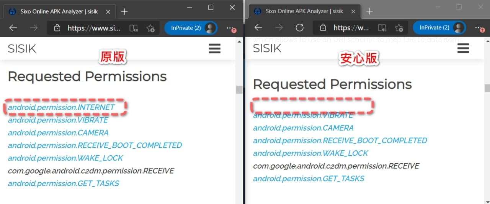
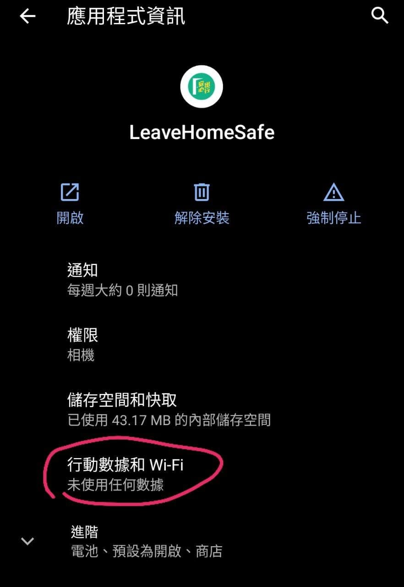

# 安心出行 Android 離線安心版
透過改修APK，移除網絡使用權限。隻APP再無可能傳送任資料去政府嘅伺服器，達至100%安心。

## 下載
<a href="https://raw.githubusercontent.com/Plarigne/leavehomesafe-android-block-network/main/LeaveHomeSafe_1.1.4_%E5%AE%89%E5%BF%83%E7%89%883.apk">LeaveHomeSafe_1.1.4_安心版3.apk</a>

首次使用可能會卡住喺 "載入中"，Kill咗個APP，再開即可。

## 原理
1. 利用 APKStudio 修改原版APK，將 AndroidManifest.xml 裡嘅  `<uses-permission android:name="android.permission.INTERNET"/>` 移除。
1. 另外由於無網絡權限會彈APP，所以亦要廢除 okhttp 程式庫。 

## 如何驗証 APK 真係無網絡權限?

可使用 https://www.sisik.eu/apk-tool 查看權限:

如下圖：

另外，應用程式資訊亦會顯示: 未使用任何數據：

## 呢隻 APP 真係安全?
一般嚟講，唔建議用家安裝不明來歷嘅 APK，因為可能俾不法之徒加料。但如上所說，此 APK 已無網絡權限，都做唔到咩花樣，唔會偷到嘢。

## 你呃人，無 Source Code 嘅?
其實我都無Java Source Code，如要睇 Smali Source Code，只要用 apkstudio 打開 apk 就睇到晒。
